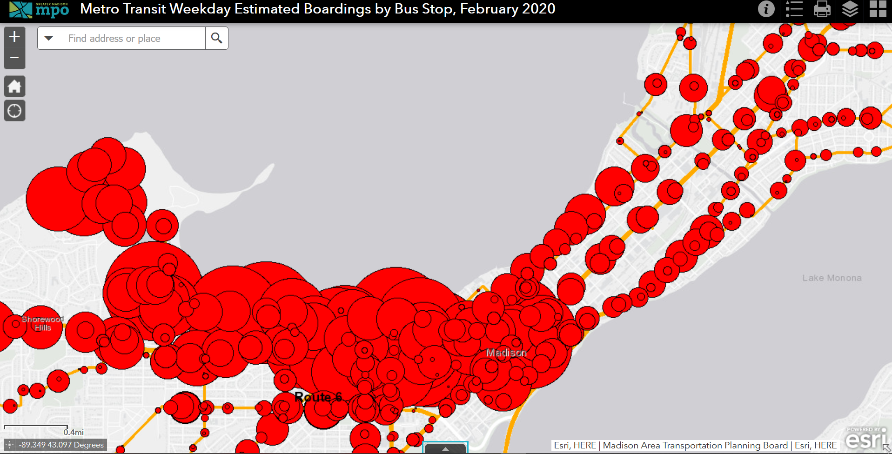

```{r setup, include=FALSE}
knitr::opts_chunk$set(list(echo = FALSE, message = FALSE, warning = FALSE, results = FALSE))
```


Madison Metro publishes data boardings per stop on the City of Madison Open Data Portal. The data is also made available on what colloquially is known as the "red dot map" -- which isn't the most appealing visualization format:




Here I'm using the `mapdeck` package to create an interactive 3D map visualization of the data, augmented with bus routes and a population density heatmap.

```{r}
library(tidyverse)
library(sf)
library(mapdeck)
```

```{r}
boardings <- st_read("data/Metro_Transit_Ridership_by_Stop.shp")
```
```{r}
boardings <- 
  boardings %>% 
  mutate(tooltip = paste0("Stop: ",
                          StopDescri,
                          "<br>",
                          "Weekday boardings: ",
                          Weekday))
library(mapdeck)
```

# Boardings only

Zoom in to see the data. Hover over the columns for more information. Right-click and drag to change the view angle and orientation.

```{r results=TRUE}
mapdeck(style = 'mapbox://styles/mapbox/light-v10', pitch = 45) %>% 
  mapdeck::add_column(data = boardings, 
                      elevation = "Weekday",
                      radius = 20,
                      fill_colour = "Weekday",
                      legend = T,
                      legend_format = list( fill_colour = as.integer ),
                      legend_options = list(title = "Weekday boardings"),
                      tooltip = "tooltip"
                      )
```

The map really shows how much ridership is driven by the UW Campus and downtown. Also very visible are the four transfer points.

# Add Metro routes
I'm using the Metro GTFS data to add all routes to the map. You will notice that there are stops on the map that aren't on any route. This is because the boardings data is from just before the pandemic started, whereas the routes are current and include the ones that have been cut.

```{r}
library(tidytransit)
gtfs <- read_gtfs("http://transitdata.cityofmadison.com/GTFS/mmt_gtfs.zip")
```
```{r results=TRUE, preview = TRUE}
gtfs_sf <- gtfs_as_sf(gtfs)

mapdeck(style = 'mapbox://styles/mapbox/light-v10', 
        pitch = 45) %>% 
  mapdeck::add_column(data = boardings, 
                      elevation = "Weekday",
                      radius = 20,
                      fill_colour = "Weekday",
                      legend = T,
                      legend_format = list( fill_colour = as.integer ),
                      legend_options = list(title = "Weekday boardings"),
                      tooltip = "tooltip"
                      ) %>% 
  add_sf(gtfs_sf$shapes,
         stroke_colour = "#ff6666")
```


# Add population density

Density is  one important condition for high transit ridership. So let's add a heatmap with population density as a layer. Job density would be another interesting variable to look at, but I'll leave that for another day.

```{r}
library(tidycensus)
options(tigris_use_cache = TRUE)

v18 <- load_variables(2018, "acs5", cache = TRUE)


pop <- get_acs(geography = "block group",
               survey = "acs5", 
               variables = "B01003_001", 
               state = 55, 
               county = "Dane", 
               geometry = T,
               keep_geo_vars = T)

pop <- pop %>% 
  filter(estimate != 0) %>% #filter out the lakes
  mutate(pop_density = log(estimate / (ALAND * 3.861021585E-7))) #convert to people per sq mi from sq meter
```


```{r results=TRUE}
mapdeck(style = 'mapbox://styles/mapbox/light-v10', 
        pitch = 45) %>% 
  add_polygon(data = pop, 
              palette = "magma",
              fill_colour = "pop_density",
              fill_opacity = 0.5,
              legend = F) %>% 
  add_sf(gtfs_sf$shapes,
         stroke_colour = "#ff6666") %>% 
  mapdeck::add_column(data = boardings, 
                      elevation = "Weekday",
                      radius = 20,
                      fill_colour = "Weekday",
                      legend = T,
                      legend_format = list( fill_colour = as.integer ),
                      legend_options = list(title = "Weekday boardings"),
                      tooltip = "tooltip"
                      )
  
```
